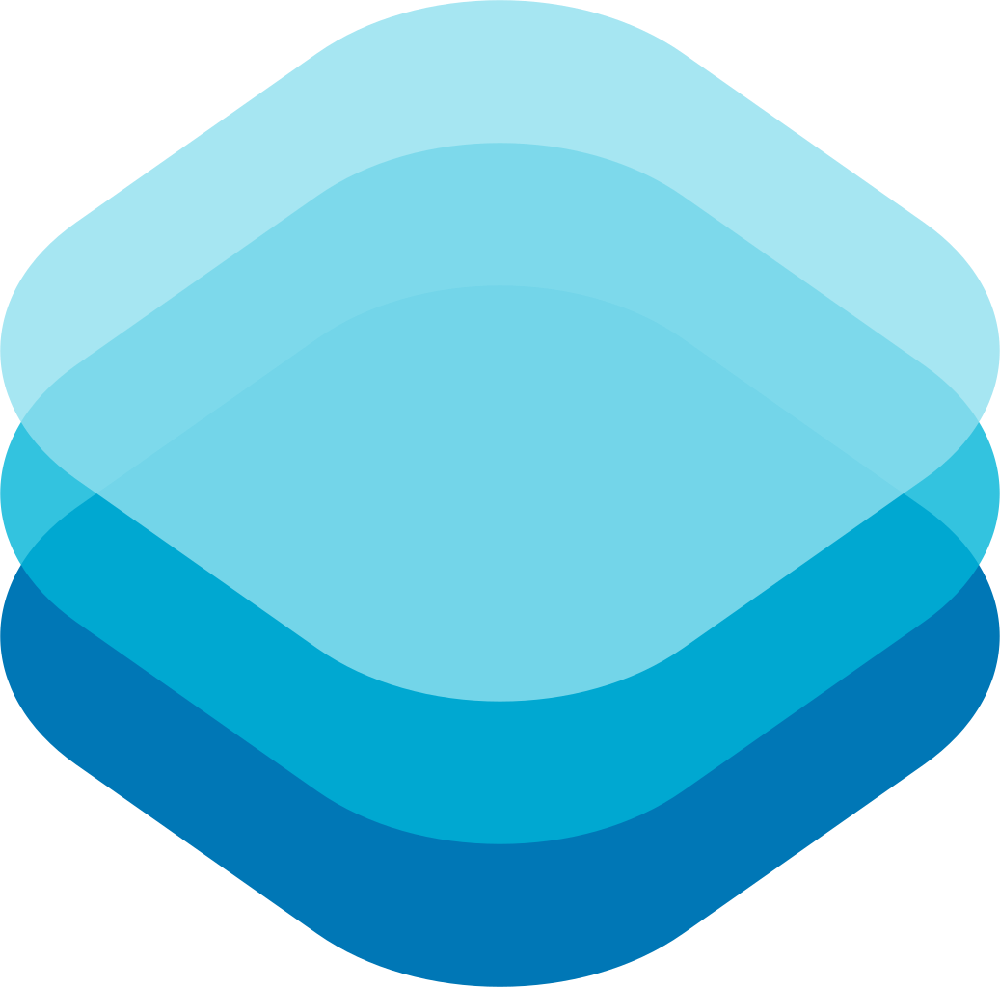
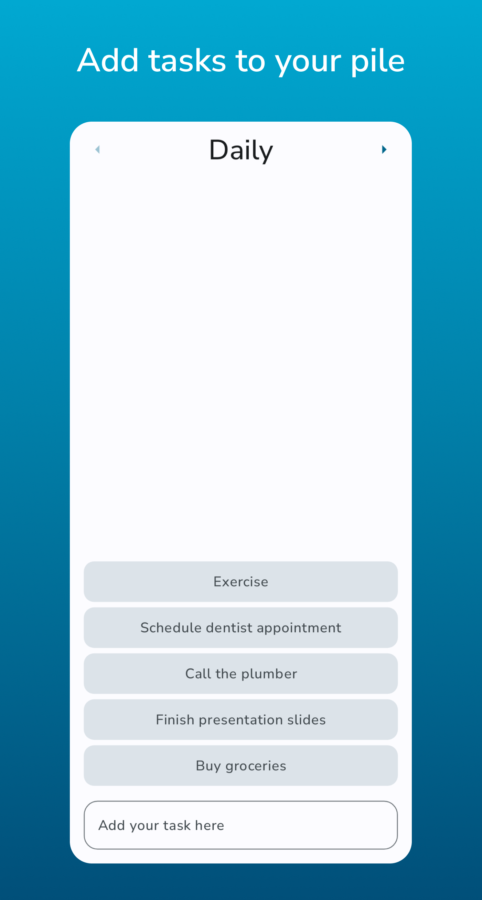
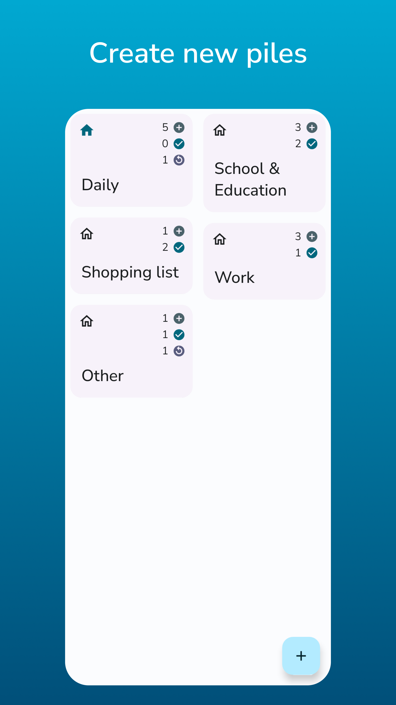

<!-- READme template from: https://github.com/othneildrew/Best-README-Template
 MIT License Copyright (c) 2021 Othneil Drew -->

 

  

<h3 align="center">piley</h3>

  

    <a href="https://github.com/justdeko/piley/issues">report bug</a>
    ·
    <a href="https://github.com/justdeko/piley/issues">suggest feature</a>
  

  
<table border="0" cellpadding="0" cellspacing="0">
<tr>
<td></td>
<td></td>
</tr>
</table>

    <a href="https://testflight.apple.com/join/zVQVUXFb">iOS Testflight Beta</a>
    ·
    <a href="https://github.com/justdeko/piley/releases">Mac release</a>
  

<!-- TABLE OF CONTENTS -->

  
Table of Contents

  <ol>
    <li>
      <a href="#about-piley">About piley</a>
      <ul>
        <li><a href="#built-with">Built with</a></li>
      </ul>
    </li>
    <li>
      <a href="#getting-started">Getting Started</a>
    </li>
    <li><a href="#planned-features">Planned Features</a></li>
    <li><a href="#contributing">Contributing</a></li>
    <li><a href="#license">License</a></li>
  </ol>

## About piley

piley is a small To-Do app that uses piles to manage your tasks. You can stack up tasks within a
pile, create new piles and also set reminders and recurring tasks. piley was built using Compose Multiplatform and is available on Android, iOS and Desktop. 

  

    
    
     
    
  

### Built With

piley is built with Jetpack Compose Multiplatform. Other following libraries were used:

* [Room](https://developer.android.com/training/data-storage/room) for data storage
* [Material3 UI Elements](https://developer.android.com/jetpack/androidx/releases/compose-material3)
  and Compose navigation
* [FileKit](https://github.com/vinceglb/FileKit) for multiplatform file pickers
* [Reorderable](https://github.com/Calvin-LL/Reorderable) for drag and drop reordering of piles
* Various Jetpack Compose and AndroidX dependencies for specific functionality

## Getting Started

### Android

To start using piley on Android, you can just download it from [Google
Play](https://play.google.com/store/apps/details?id=com.dk.piley), or get the newest debug apk from the
**[Releases](https://github.com/justdeko/piley/releases)** section.

### iOS

piley is available for iOS and iPadOS, [you can download it here](https://apps.apple.com/us/app/piley/id6742054302).
There is also an open testing beta, [you can sign up here](https://testflight.apple.com/join/zVQVUXFb).

### Desktop

piley for desktop is currently only available for Mac as an unsigned `.dmg` file. Get it under "Assets" of the [latest release](https://github.com/justdeko/piley/releases) in the releases section.

## Planned features

To view planned features and track the general progress, visit
the [project board](https://github.com/users/justdeko/projects/1).

## Contributing

piley is FOSS and was developed for free. You are welcome to contribute and support, here are a few
ways:

* [Report a bug or suggest a new feature](https://github.com/justdeko/piley/issues)
* Translate the app into your language and open a new PR for it
* Extend the app

## License

[Apache License 2.0](https://github.com/justdeko/piley/blob/main/LICENSE)

(<a href="#readme-top">back to top</a>)

