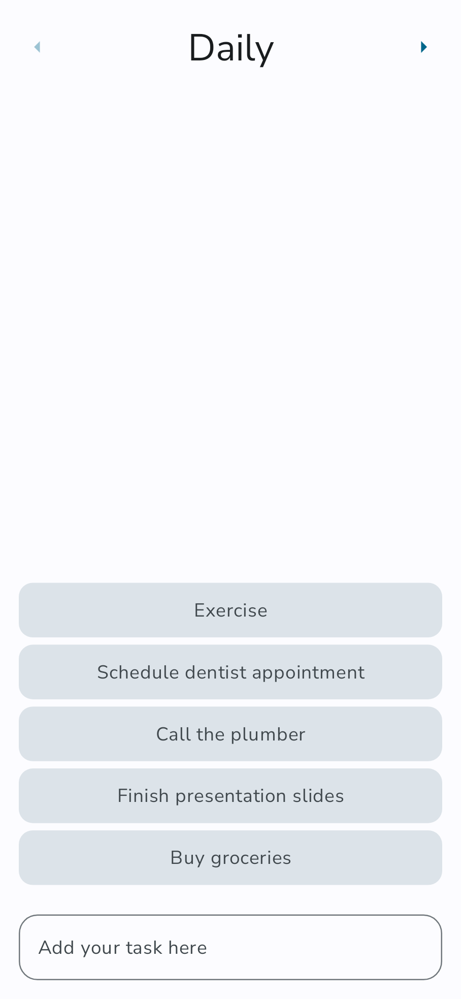
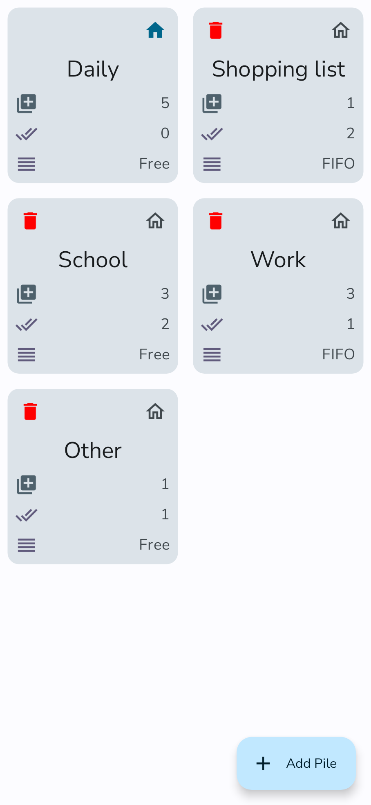
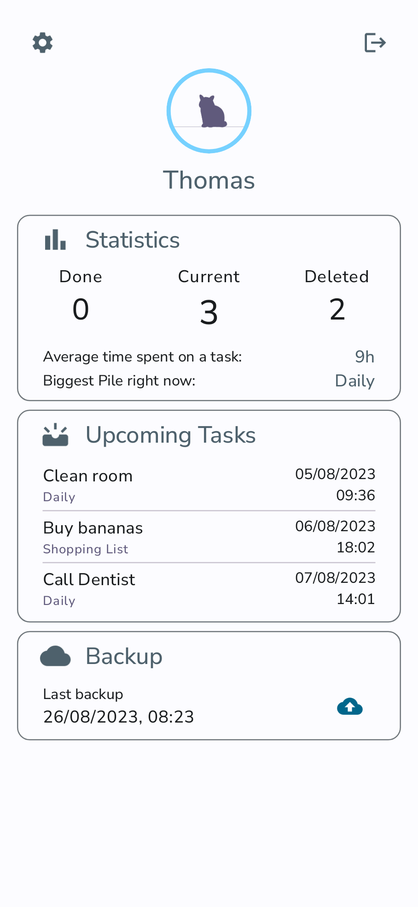

<!-- READme template from: https://github.com/othneildrew/Best-README-Template
 MIT License Copyright (c) 2021 Othneil Drew -->

 

  

<h3 align="center">piley</h3>

  

    <a href="https://github.com/justdeko/piley/issues">Report Bug</a>
    ·
    <a href="https://github.com/justdeko/piley/issues">Suggest Feature</a>
  

<!-- TABLE OF CONTENTS -->

  
Table of Contents

  <ol>
    <li>
      <a href="#about-piley">About piley</a>
      <ul>
        <li><a href="#tools-used">Tools used</a></li>
      </ul>
    </li>
    <li>
      <a href="#getting-started">Getting Started</a>
      <ul>
        <li><a href="#connect-to-piley-server">Connect to piley-server</a></li>
      </ul>
    </li>
    <li><a href="#contributing">Contributing</a></li>
    <li><a href="#license">License</a></li>
  </ol>

## About piley

piley is a small To-Do app that uses piles to manage your tasks. You can stack up tasks within a
pile, create and manage your piles and also set reminders and recurring tasks. If you set up a
server, you can also back up your tasks and sync regularly to get the newest state.

  

    
     
    
  

(<a href="#readme-top">back to top</a>)

### Built With

piley is a native Android app built with Jetpack Compose. The following libraries were used:

* [Hilt](https://dagger.dev/hilt/) for dependency injection
* [Room](https://developer.android.com/training/data-storage/room) for data storage
* [OkHttp](https://square.github.io/okhttp/) and [Retrofit](https://github.com/square/retrofit) for
  remote calls
* [Material3 UI Elements](https://developer.android.com/jetpack/androidx/releases/compose-material3)
  and Compose navigation
* Various Jetpack Compose, AndroidX and Accompanist dependencies for specific functionality

(<a href="#readme-top">back to top</a>)

## Getting Started

To start using piley, you can just get the apk from the
**[Releases](https://github.com/justdeko/piley/releases)** section.

However, this will not
have any remote functionality and you will have to use offline mode (just check the offline mode
checkbox when registering).
The API url is by default `10.0.2.2`, which is used in emulators to connect to the localhost
environment of the emulator host.

### Connect to piley-server

If you want to connect your app to a self-hosted piley-server backend to upload backups, you need to
run the `build-with-custom-url.sh`script which will result in a debug apk with the target URL you
entered. The URL should have a valid SSL certificate.

If you also want to build a release apk with your custom url or use an endpoint with a self-signed
SSL certificate, you will have to manually change the
network security config and include your certificate in `trust-anchors`. Then build the release apk
as usual using Android Studio or the CLI.

For information on getting started with
piley-server, [go here](https://github.com/justdeko/piley-server).

(<a href="#readme-top">back to top</a>)

## Contributing

piley is FOSS and was developed for free. You are welcome to contribute and support, here are a few
ways:

* [Report a bug or suggest a new feature](https://github.com/justdeko/piley/issues)
* Translate the app into your language and open a new PR for it
* Extend the app

(<a href="#readme-top">back to top</a>)

## License

[MIT](https://github.com/justdeko/piley/blob/main/LICENSE)

(<a href="#readme-top">back to top</a>)

