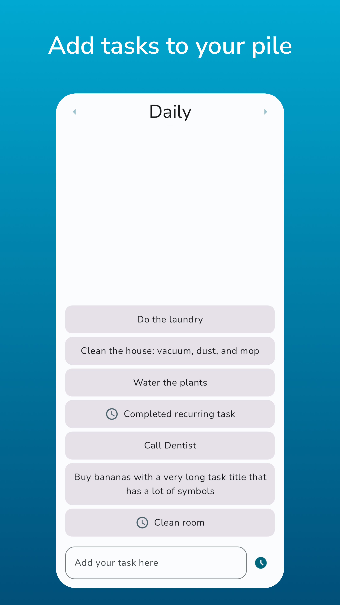
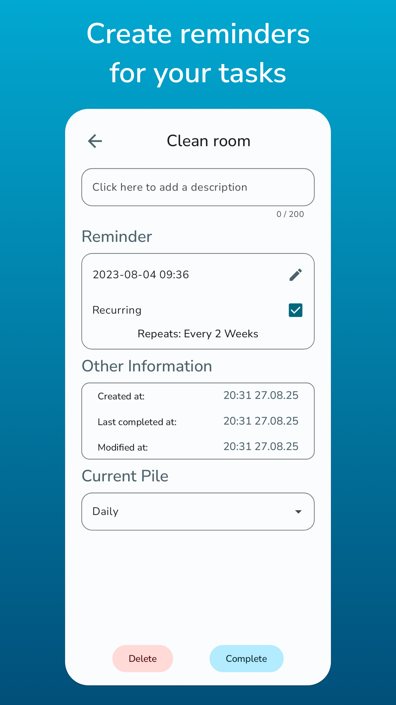

<!-- READme template from: https://github.com/othneildrew/Best-README-Template
 MIT License Copyright (c) 2021 Othneil Drew -->

 

  

<h3 align="center">piley</h3>

  

    <a href="https://github.com/justdeko/piley/issues">report bug</a>
    ·
    <a href="https://github.com/justdeko/piley/issues">suggest feature</a>
    ·
    <a href="https://github.com/justdeko/piley-server">piley-server</a>
  

<!-- TABLE OF CONTENTS -->

  
Table of Contents

  <ol>
    <li>
      <a href="#about-piley">About piley</a>
      <ul>
        <li><a href="#tools-used">Tools used</a></li>
      </ul>
    </li>
    <li>
      <a href="#getting-started">Getting Started</a>
      <ul>
        <li><a href="#connect-to-piley-server">Connect to piley-server</a></li>
      </ul>
    </li>
    <li><a href="#contributing">Contributing</a></li>
    <li><a href="#license">License</a></li>
  </ol>

## About piley

piley is a small To-Do app that uses piles to manage your tasks. You can stack up tasks within a
pile, create and manage your piles and also set reminders and recurring tasks. If you set up a
server, you can also back up your tasks and sync regularly to get the newest state.

  

    
    
     
    
  

(<a href="#readme-top">back to top</a>)

### Built With

piley is a native Android app built with Jetpack Compose. The following libraries were used:

* [Hilt](https://dagger.dev/hilt/) for dependency injection
* [Room](https://developer.android.com/training/data-storage/room) for data storage
* [OkHttp](https://square.github.io/okhttp/) and [Retrofit](https://github.com/square/retrofit) for
  remote calls
* [Material3 UI Elements](https://developer.android.com/jetpack/androidx/releases/compose-material3)
  and Compose navigation
* Various Jetpack Compose, AndroidX and Accompanist dependencies for specific functionality

(<a href="#readme-top">back to top</a>)

## Getting Started

To start using piley, you can just get the newest apk from the
**[Releases](https://github.com/justdeko/piley/releases)** section, or download it from [google
play](http://play.google.com/store/apps) (coming soon)

### Connect to [piley-server](https://github.com/justdeko/piley-server)

If you want to connect your app to a self-hosted piley-server backend to upload backups, you can
input the url when signing in. You can also change the endpoint URL later in the user settings if
your server location changes. The application allows cleartext traffic, meaning your endpoint can
also be http.

The API url is by default `10.0.2.2` or `127.0.0.1` depending on the build type, which is used in
emulators to connect to the localhost
environment of the emulator host or the local computer api. You will need to change it unless you
are running the app in an emulator.

If you want to use an endpoint with a self-signed
SSL certificate, you will have to manually add a
network security config and include your certificate in `trust-anchors`. Then build the release apk
as usual using Android Studio or the CLI. For more information about custom
certificates, [read the official documentation](https://developer.android.com/training/articles/security-config#CustomTrust).

For information on getting started with
piley-server, [go here](https://github.com/justdeko/piley-server).

(<a href="#readme-top">back to top</a>)

## Planned features

To view planned features and track the general progress, visit
the [project board](https://github.com/users/justdeko/projects/1).

(<a href="#readme-top">back to top</a>)

## Contributing

piley is FOSS and was developed for free. You are welcome to contribute and support, here are a few
ways:

* [Report a bug or suggest a new feature](https://github.com/justdeko/piley/issues)
* Translate the app into your language and open a new PR for it
* Extend the app

(<a href="#readme-top">back to top</a>)

## License

[MIT](https://github.com/justdeko/piley/blob/main/LICENSE)

(<a href="#readme-top">back to top</a>)

