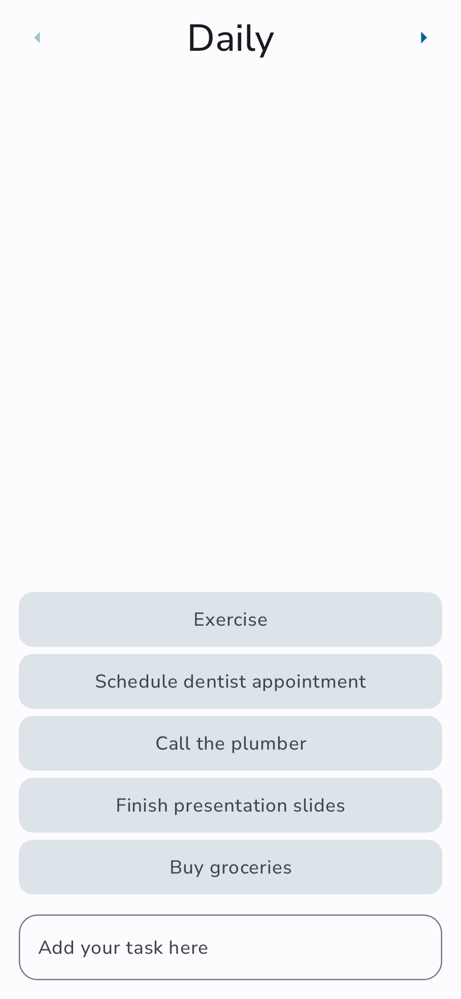
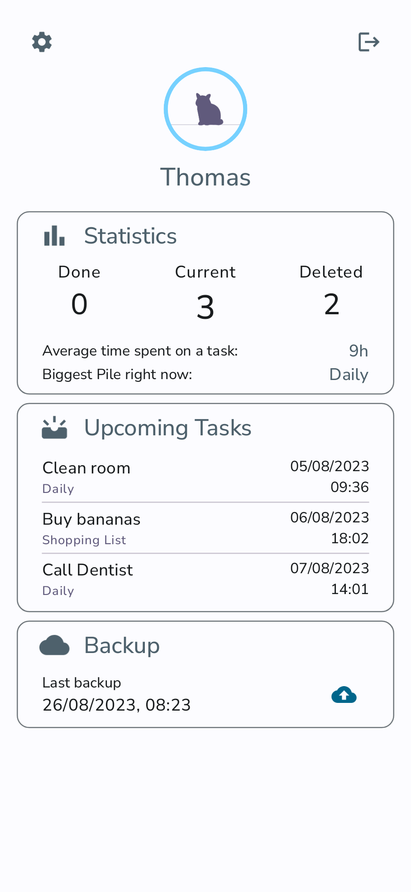

    

You can stack up tasks within a pile, create and manage your piles and also set reminders and
recurring tasks. If you set up a
server, you can also back up your tasks and sync regularly to get the newest state.

## How to use

Just download the source code and compile the app, or get one of the released apks.

## Screenshots

  

    
     
    
  

